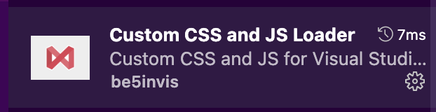
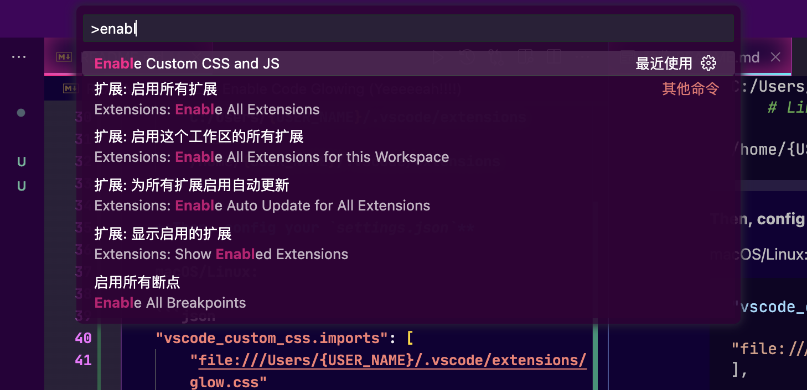
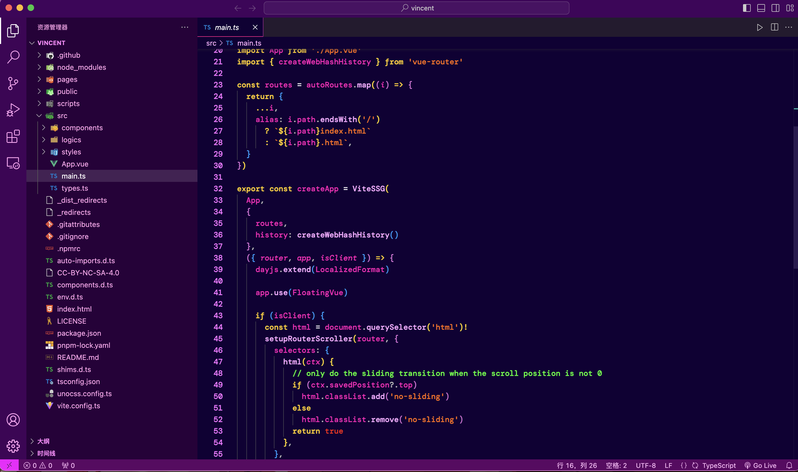
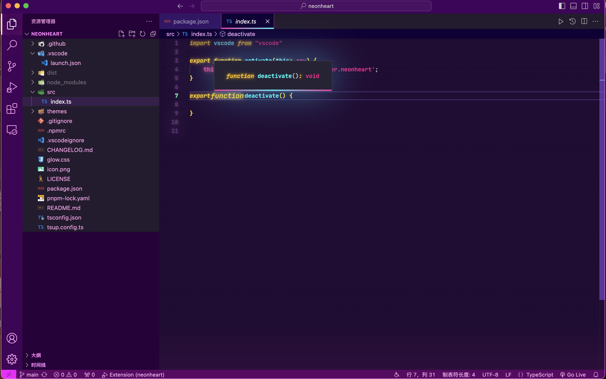

<h1 align="center">NeonHeart</h1>
<p align="center">An opinionated VS Code theme.</p>

<p align="center">
<a href="https://marketplace.visualstudio.com/items?itemName=vincent-the-gamer.neonheart" target="__blank"></a>
</p>

<p align="center">
    <b><i>Let the neon lights colorize your heart. (๑•̀ㅂ•́)و✧</i></b>
</p>

# Installation

Search `neonheart` in VS Code extension menu.

# Enable Code Glowing (Yeeeeeah!!!!)

Use `Custom CSS and JS Loader` extension.



1. Install it.
2. Config your path of `glow.css` in `settions.json`.

> [!WARNING]
> `file://` is required!!!!

macOS:

```json
"vscode_custom_css.imports": [
    "file:///Users/{USER_NAME}/.vscode/extensions/vincent-the-gamer.neonheart-{plugin-version}/glow.css"
],
```

Windows: 
```json
"vscode_custom_css.imports": [
    "file://C:/Users/{USER_NAME}/.vscode/extensions/vincent-the-gamer.neonheart-{plugin-version}/glow.css"
],
```

Linux:

```json
"vscode_custom_css.imports": [
    "file:///home/{USER_NAME}/.vscode/extensions/vincent-the-gamer.neonheart-{plugin-version}/glow.css"
],
```

3. Run Enable Custom CSS and JS

    - `Ctrl + Shift + P` or `Command + Shift + P`
    - Input `enable custom css and js`
        


# Preview

## Normal


## Glowing


# Changelog
View [Changelog](./CHANGELOG.md)

# License
[MIT](./LICENSE)